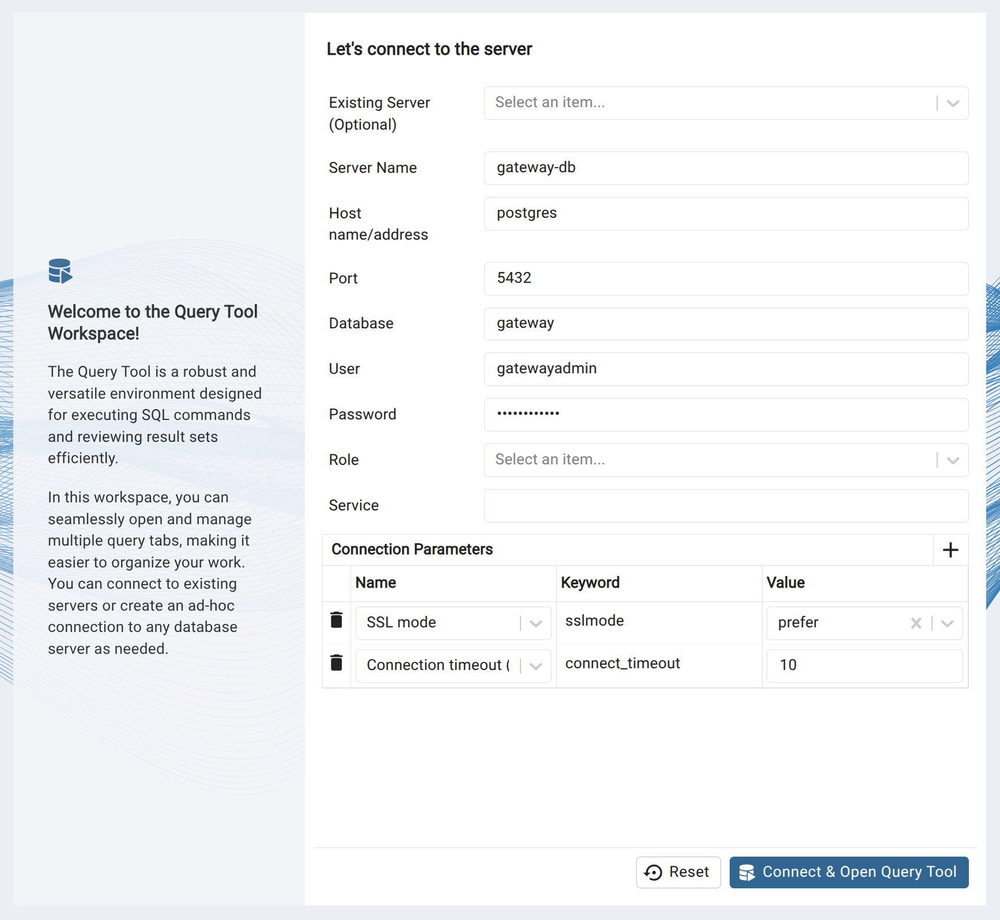

# Gateway routers scan analysis

When it comes up, just use the default credentials to access the database:
- Username: `gatewayadmin`
- Password: `gatewayadmin`

Start database (not necessary; it should already be running on superserver):
```bash
docker compose up
```

Set up venv for all the Python scripts:
```bash
python3 -m venv venv
source venv/bin/activate
pip install -r requirements.txt
```

Set up password auto-fill:
```bash
echo "localhost:6789:*:gatewayadmin:gatewayadmin" > ~/.pgpass
chmod 600 ~/.pgpass
```

Connect to database from terminal: 
```bash
./connect.sh
```

Connect to database GUI (pgadmin) from browser:
```bash
./pgadmin.sh
```

To connect to the server:


## Database organization

After connecting to the database, run `\dt` and `\dm` to see what are out there.
- `full_t` stores all the entries annotated
- `filtered_t` stores all the entries likely generated by SLAAC with privacy extensions (we do most postprocessing based on this table)
- `unique_repliers` reads in `filtered_t` and keeps one unique reply from each srcip (many devices reply multiple times) so that we don't overcount
- `dups_t` reads on `unique_repliers` and keeps only those entries seen with duplicated lower-64 bits
- `pfx2as2org` stores the CAIDA mapping from prefix to AS to organization
- `dups_t_mapped` is the mapping between `dups_t` and `pfx2as2org`
- `id_key` is keyed on hostid, with each row storing info about which networks, ASes, and organizations they are from

## Import data (it's done on superserver already)

> Probing data is mounted on `/mnt/usb`. So far, we have three files with data: `combined-48s-r1-s56.csv.bz2`, `combined-48s-r2-s60.csv.bz2`, `combined-48s-r3-s64.csv.bz2`.

Decompress data and write it to `/dbdata`:
```bash
nohup ./helper/decompress.sh &
```

Split files into smaller chunks for later processing:
```bash
nohup ./helper/split.sh & 
```

Load data into database (might take a few hours): 
```bash
python3 import.py bigtablename smalltablename --full
```

(Or try loading a smaller test file)
```bash
python3 import.py yourtablename 
```

This script annotates all the entries with a few additional fields:
```sql
CREATE TABLE IF NOT EXISTS yourtablename (
    Protocol         text,
    TgtIP            inet,
    SrcIP            inet,
    HopLim           smallint,
    ICMPv6Type       smallint,
    ICMPv6Code       smallint,
    RTT              integer,
    hostid           text,        -- lower 64 bits (interface indetifier)
    netid            cidr,        -- upper 64 bits (network identifier)
    entropy          real,        -- shannon entropy over hostid hex digits
    ratio            real,        -- 1 v.s. 0 ratio over hostid binary digits
    spl              smallint,    -- shared prefix length btwn tgtip and replier device prefix
    router_type      smallint,    -- inferred router type (not used)
    policy           smallint     -- inferred router hostid assignment policy
);
```

We use entropy (e >= 0.65) and 1-0 ratio (0.375 <= r <= 0.625) to guess host identifier assignment policy.

Since we only care about the addresses likely generated by SLAAC with pricvacy extensions, the script writes all the entries with addresses likely generated in such ways to table `filtered_t`. A full record of all the entries is stored in `full_t` (so it would be like `python3 import.py full_t filtered_t --full`). 

Import CAIDA's pfx2as dataset:
- [Link to all datasets](https://publicdata.caida.org/datasets/routing/routeviews6-prefix2as/)
- Here we use `routeviews-rv6-20250730-0600.pfx2as`
```bash
./helper/pfx2as.sh
```

Import CAIDA's as2org dataset: 
- Here we use `20250801.as-org2info.txt`
```bash
./helper/as2org.sh
```